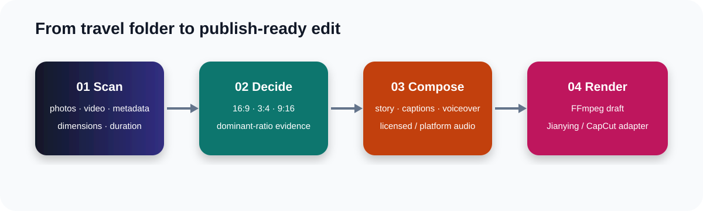
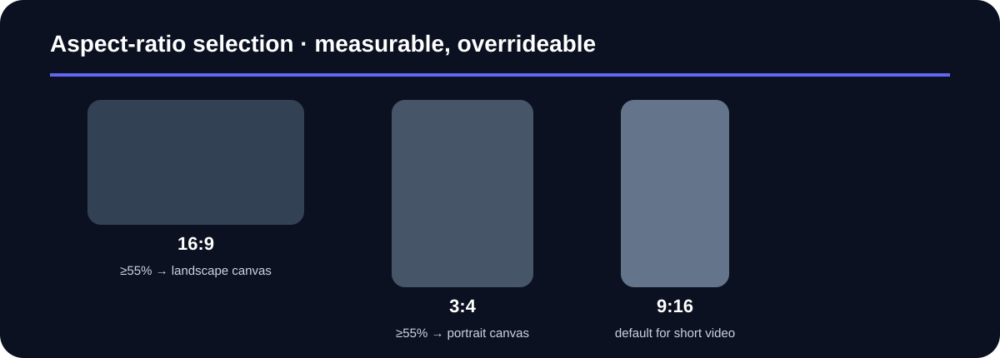

# ✈️ Travel Video Auto Editor

> **Drop in a travel folder. Get a story-shaped edit plan. Render for FFmpeg, Jianying, or CapCut.**
>
> 把一整个旅行素材文件夹交给 Skill，自动分析画幅、挑选镜头、规划节奏、配音和音乐，并生成可以继续交给 FFmpeg、剪映或 CapCut 适配器的统一剪辑清单。

[](SKILL.md)
[](LICENSE)
[](references/README.en.md)

## 📚 Documentation / 文档

先从双语文档开始：

- [中文文档](https://github.com/wp2463496/travel-video-auto-editor/blob/main/references/README.zh-CN.md)
- [English documentation](https://github.com/wp2463496/travel-video-auto-editor/blob/main/references/README.en.md)

## What it does

Travel Video Auto Editor is a reproducible editing brain for travel content. It inspects real media metadata instead of guessing from filenames, turns a messy folder into a structured edit manifest, and leaves the final renderer replaceable.

- **Folder-first ingestion** — scan nested folders of JPG, PNG, WebP, HEIC, MP4, MOV, M4V, WebM, and MKV.
- **Evidence-based canvas** — choose 16:9, 3:4, or 9:16 from measured media shares; override it for a campaign or platform.
- **Story-aware sequencing** — hook → arrival → details → movement → closing, with rejected shots preserved for review.
- **Voiceover-ready** — generate a grounded bilingual script or hand it to your TTS provider.
- **Platform music workflow** — use a user-selected Douyin, TikTok, or Jianying catalog excerpt, a local file, or a separately licensed track; store track ID, excerpt timing, platform, and usage context.
- **Portable output** — one manifest can drive an FFmpeg renderer or a versioned Jianying/CapCut adapter.
- **Review before publishing** — output stays local until a user explicitly exports or publishes it.



## Why this is different

Most auto-editing demos jump straight from “upload” to “export”. This project keeps the decisions inspectable: every input is measured, the aspect-ratio decision has evidence, selected and rejected media are explicit, and audio choices are recorded. That makes it useful for a creator workflow, a batch pipeline, or a GitHub integration demo.



## Quick start

```bash
git clone https://github.com/YOUR-ORG/travel-video-auto-editor.git
cd travel-video-auto-editor

# Scan a folder and create a manifest
python3 scripts/analyze_media.py ./my-trip --output ./output

# Force a platform format when needed
python3 scripts/analyze_media.py ./my-trip \
  --output ./output \
  --aspect 9:16 \
  --language zh-CN
```

The first command creates `output/edit-manifest.json`. It never modifies the source folder.

## Example manifest

```json
{
  "canvas": { "aspect": "9:16", "width": 1080, "height": 1920 },
  "analysis": { "shares": { "16:9": 0.18, "3:4": 0.11, "portrait": 0.52 } },
  "selection": {
    "selected": [
      { "shot_id": "shot-003", "start_s": 0, "end_s": 3.2, "crop": "cover", "reason": "best establishing shot" },
      { "shot_id": "shot-011", "start_s": 3.2, "end_s": 6.8, "crop": "blur-fill", "reason": "food detail" }
    ]
  },
  "audio": {
    "license": {
      "platform": "douyin",
      "track_id": "platform-track-id",
      "excerpt_start_s": 14.0,
      "excerpt_end_s": 34.0,
      "usage_context": "in_platform_publish"
    }
  }
}
```

## Architecture

```text
media folder
    │
    ▼
metadata scanner ──► aspect-ratio evidence ──► story selector
                                              │
                         ┌────────────────────┼───────────────────┐
                         ▼                    ▼                   ▼
                    captions             voiceover          platform audio
                         └────────────────────┼───────────────────┘
                                              ▼
                                  edit-manifest.json
                                    │                 │
                                    ▼                 ▼
                              FFmpeg draft    Jianying / CapCut adapter
```

The manifest is the contract. Renderers can change without changing analysis or editorial decisions. See [manifest-schema.md](references/manifest-schema.md) and [jianying-adapter.md](references/jianying-adapter.md).

## Music and platform usage

The workflow supports short excerpts selected from in-platform music libraries. It records the platform, track ID, excerpt range, territory, and publishing context. It does not scrape chart pages or bypass platform access controls. Availability can depend on the account, region, and publishing surface; the adapter should preserve the platform context when creating a native project.

## Project references

- [Skill instructions](SKILL.md)
- [Manifest schema](references/manifest-schema.md)
- [Jianying / CapCut adapter guide](references/jianying-adapter.md)
- [Contributing](CONTRIBUTING.md)
- [Changelog](CHANGELOG.md)

## Roadmap

- [x] Deterministic media inventory
- [x] Aspect-ratio recommendation with manual override
- [x] Bilingual documentation and manifest contract
- [ ] Pluggable scene and duplicate detection
- [ ] FFmpeg timeline renderer with captions and voiceover ducking
- [ ] Versioned Jianying / CapCut project exporters
- [ ] Optional TTS and platform music provider adapters
- [ ] Batch mode and CI-generated preview artifacts

## Contributing

Issues and pull requests are welcome. Please do not commit personal media, generated videos, API keys, or music files whose redistribution is not permitted. Keep adapters versioned and preserve the manifest as the source of truth.

## License

MIT. Third-party tools, music catalogs, TTS services, and platform adapters may have separate terms; see their respective documentation.
